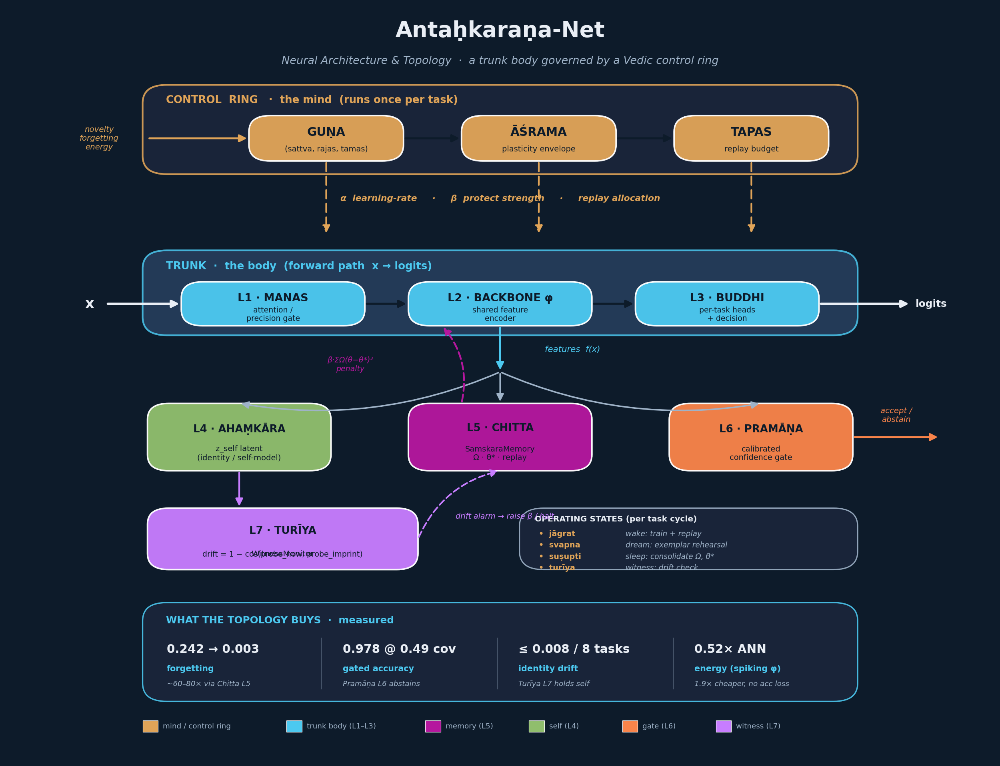

# Antaḥkaraṇa-Net — Neural Network Architecture & Topology

A layer-by-layer specification of the network, grounded in the ChittaKit codebase
(`chittakit/*.py`, `experiments/*.py`). The system is **not** a single feed-forward
stack. It is a *trunk network* (the body that perceives and decides) wrapped by a
*ring of control faculties* (the mind that governs how the trunk learns, protects
itself, allocates effort, and reports). Each layer below states **how it works** (the
mechanism actually implemented) and **what is possible** (the capability it unlocks /
where it can be pushed).

---

## 0. Topology at a glance



*(Regenerate with `python3 make_topology_figure.py` → `assets/topology.png`.)*

The trunk (L1→L2→L3) is the only path that touches the input and produces logits.
Everything else **reads** the trunk's weights/features/logits and **writes back**
hyperparameters, penalties, or accept/abstain decisions. This is why the system can
learn a long stream of tasks without catastrophic forgetting: the mind keeps
re-tuning *how* the body learns, task by task.

---

## L1 — MANAS (मनस्) · Perception / Precision-Weighted Attention Gate

**How it works.** Manas is the input-facing stage that decides *what gets through*.
In the implemented MLPs it is the first `Linear → ReLU`; in the design it is a
precision-weighted attention encoder: `softmax(QKᵀ/√d) · π(x, z_self)` — a standard
attention map multiplied by a *precision* term `π` that is conditioned on the current
self-state `z_self` (from L4). High precision = sharp, selective attention; low
precision = diffuse. The kleśa module (`klesha.py`) supplies the uncertainty signal:
`normalized_avidya(logits) = H[p(y|x)] / log K`, the predictive entropy normalized to
[0,1]. High avidyā (entropy) = "I don't recognize this" = novelty.

**What is possible.**
- Swap the dense first layer for true top-k serial attention so the agent *foveates*
  one region/token at a time (manas as a serial bottleneck, matching the "17
  mind-moments" discrete-attention model in `philosophy/sanskrit-formulae-of-mind.md`).
- Feed `π` from the self-state to get *attentional set* — the same input attended
  differently depending on goal/identity.
- Use `normalized_avidya` not just as a novelty meter but as an active gate: route
  high-entropy inputs to slower, more careful processing (links to L6 Pramāṇa).

---

## L2 — BACKBONE φ · Shared Feature Encoder (the body that generalizes)

**How it works.** The shared trunk that all tasks reuse:

```python
# experiments/integrated_agent.py
self.backbone = nn.Sequential(
    nn.Linear(dim, hidden), nn.ReLU(),
    nn.Linear(hidden, hidden), nn.ReLU(),
)
def features(self, x): return self.backbone(x)   # exposed for the witness (L7)
```

The whole continual-learning premise (`experiments/data.py::make_shared_feature_tasks`)
is that **one fixed nonlinear teacher φ generates all tasks**; tasks differ only in a
linear readout. So a backbone that learns φ *can* solve every task — the capacity
headroom exists — but each new task's gradients can overwrite φ. This is the
catastrophic-forgetting battlefield, and it is exactly the weights L5 (Chitta) protects.

Backbone variants implemented:
- **MLP** (Track A / integrated agent): `Linear→ReLU→Linear→ReLU`.
- **CNN** (Phase II, `phase2_vision.py`): conv stack on Split-MNIST / Split-CIFAR-10.
- **Spiking MLP** (Track C, `track_c_spiking.py`): `fc1→LIF→fc2→LIF`, T=20 rate-coded
  timesteps, β=0.9 leak, fast-sigmoid surrogate gradient.
- **Q-network backbone** (Track B, `track_b_v2.py`): `Linear(3,64)→ReLU→Linear(64,64)→ReLU`
  shared navigation features for an RL forager.

**What is possible.**
- Replace φ with a transformer/ResNet/SSM trunk — the control ring is backbone-agnostic
  because every faculty operates on `named_parameters()`, `features()`, or `logits`.
- The spiking variant gives **~1.9× energy reduction (51.7% of ANN energy)** at
  ~10.7% spike density with *no* accuracy loss (SNN 0.943 vs ANN 0.929) — a path to
  neuromorphic deployment where the same Vedic control ring governs an event-driven body.

---

## L3 — BUDDHI (बुद्धि) · Per-Task Readout + Decision

**How it works.** Buddhi is discrimination/decision. Implemented as **per-task heads**
over the shared backbone:

```python
self.heads = nn.ModuleList([nn.Linear(hidden, 2) for _ in range(n_tasks)])
def forward(self, x, task): return self.heads[task](self.backbone(x))
```

This task-conditioned readout is a deliberate design fix: a single head *cannot* hold
contradictory functions across tasks, so the body keeps shared features in φ and lets
each head specialize. (Track B re-discovered the same fix — a single-head Q-net
couldn't hold contradictory regimes; multi-head solved it.) The design-level form of
buddhi is a **drift-diffusion accumulator**: `dE = v(percept)·dt + σ·dW`, deciding when
evidence crosses a bound — and/or an **expert-gating** `argmax gate(e)` for mixture
routing.

**What is possible.**
- Promote heads to a learned **mixture-of-experts** router so the agent *infers* the
  task instead of being told (`argmax gate`), enabling task-free continual learning.
- Implement the literal drift-diffusion bound to get **speed/accuracy trade-off**
  control: tie the bound height to Tapas (L-effort) — more effort → higher bound →
  slower, more accurate decisions.

---

## L4 — AHAṂKĀRA (अहंकार) · Self-Model Latent `z_self`

**How it works.** Identity vector that persists across the agent's life:
`z_self,t = f_φ(z_self,t-1, percept_t, action_{t-1})`. It conditions manas's precision
(L1) and is what the witness (L7) ultimately guards. In the current code the *operational
proxy* for "self" is the backbone's response to a fixed probe batch (see L7); the
explicit recurrent `z_self` is specified in `philosophy/vedic-cognitive-ai-architecture.md`
as the next module to instantiate.

**What is possible.**
- Add a small GRU/recurrent latent updated every step; feed it into L1's precision and
  L3's gating so the *same* stimulus is perceived and decided differently depending on
  who the agent currently "is" (attentional set, mood, goal).
- Use `z_self` as the conditioning key for memory retrieval in L5 — recall becomes
  self-relevant, not just task-indexed.

---

## L5 — CHITTA (चित्त) · SamskaraMemory — Consolidation & Replay (the core)

**How it works.** This is the mechanism that kills catastrophic forgetting (~60–80×
reduction). Two coupled stores per parameter: importance `Ω` (vāsanā strength) and a
reference snapshot `θ*`.

*Wake penalty* (added to every training loss):
```python
def penalty(self, beta):                  # L = β · Σ Ωᵢ (θᵢ − θ*ᵢ)²
    return beta * Σ (omega[name] * (p - theta_star[name])**2).sum()
```

*Sleep consolidation* (after each task): compute Fisher importance on the just-learned
task, then **grow with decay**:
```python
# Ω ← (1 − λ)·Ω + γ·Fisher    ;   θ* ← current weights
omega[name]      = ((1-decay)*omega[name] + grow*fisher[name]).clamp_(max=omega_cap)
theta_star[name] = p.detach().clone()
```

The decay term `λ` is the key departure from vanilla EWC: old importance *fades*, so
the network stays plastic instead of freezing solid (grounded in YS 2.10–2.11 —
saṃskāras are not eternal). Replay completes the loop: a small exemplar buffer
(`mem_size=64`) per task is rehearsed during wake, with the per-task sample count set by
L-Tapas.

Metrics it exposes back to the ring: `importance_mass()` (how much is protected) and
`plasticity_headroom()` (fraction of params still free, Ω<1e-3).

**What is possible.**
- This is a **Hopfield-attractor / Bayesian-prior** view of memory
  (`mathematical-models-of-mind-and-consciousness.md`): Ω = precision of a Gaussian
  prior centered at θ*. You can swap Fisher for full-Laplace, SI (synaptic intelligence),
  or MAS importance without touching the rest of the ring.
- Tune `decay` to dial the **stability↔plasticity** frontier: λ→0 = frozen expert,
  λ→1 = goldfish. The guṇa controller (L-Guṇa) already modulates the *protection
  strength* `β` online, so this frontier becomes self-regulating.
- Replace the exemplar buffer with a generative replay model for privacy-preserving
  continual learning.

---

## L6 — PRAMĀṆA (प्रमाण) · Calibrated Confidence Gate (anti-hallucination)

**How it works.** A temperature-scaled validity gate sitting on the logits:
```python
def calibrate(logits, labels):   # fit single T so softmax(logits/T) is calibrated
    ... minimize CE(logits/T, labels) over T ...
def judge(logits):
    p = softmax(logits / T); conf, pred = p.max(-1)
    accept = conf >= threshold                       # else: abstain
    return accept, conf, pred
```

The agent **reports only what it validly perceives** and abstains otherwise. Measured
behavior: coverage ≈ 0.49 with **gated accuracy 0.978** — it answers half the time and
is almost never wrong when it does. This is Nyāya epistemology made mechanical:
extended perception must be a valid *pramāṇa*, not a guess.

**What is possible.**
- Trade coverage↔reliability by moving `threshold` (`gate_threshold=0.90` default) — a
  knob for safety-critical deployment (race-track alerts, medical triage) where a wrong
  "yes" costs more than a "don't know".
- Feed abstentions back to L1 as a request for more attention/effort, or to a human
  (active learning / escalation).

---

## L7 — TURĪYA (तुरीय) · WitnessMonitor — Identity-Drift Sentinel

**How it works.** A reward-invariant observer. At birth it imprints the backbone's
response to a fixed probe batch; thereafter it measures how far the agent has moved:
```python
def imprint(model):  self.reference = features(model, probe).clone()
def drift(model):    return 1 - cosine_similarity(features(model, probe), reference)
```
`drift ≈ 0` = stable identity; rising drift = the agent is becoming someone else.
Across the 8-task run drift stays tiny (≈0.001→0.008), confirming the consolidation
ring holds the self steady while still learning.

**What is possible.**
- Use drift as a **safety tripwire**: if drift spikes past a bound, raise β (protect
  harder) or halt updates — an internal "this change is altering who I am" alarm,
  formalizing turīya as an invariant of the state-flow.
- Monitor drift per-subspace to localize *which* faculties are shifting.

---

## CONTROL RING — how the mind governs the body each task

These are not layers in the forward path; they run once per task and set the trunk's
learning dynamics. Data flow (from `Antahkarana.live`):

### Guṇa Controller (सत्त्व·रजस्·तमस्) — the meta-controller
Maps measured signals → three qualities on a 2-simplex → concrete hyperparameters.
```python
g = guna.step(error, novelty, forgetting, energy)   # → (sattva, rajas, tamas)
alpha = α_min + (α_max−α_min)·[rajas·(1−tamas)]      # plastic when exploring & energized
beta  = β_max · sattva                                # protect when consolidating
prune = tamas                                         # conserve when depleted
```
- **rajas** (struggle + novelty) → explore, raise lr.
- **sattva** (doing well, familiar) → consolidate, raise protection.
- **tamas** (low energy/reward) → conserve, prune.

The **learned** `MetaGunaController` (3×5 weight matrix, trained by evolution strategy in
`meta_train_guna.py`) takes **measured forgetting** as an input signal — the fix for the
rule-based version over-regularizing easy tasks. *What's possible:* meta-learn the whole
control policy per domain; the guṇa simplex becomes a learned thermostat for
stability/plasticity/energy.

### Āśrama Schedule (life-stages) — developmental plasticity envelope
```python
base = α_min + (α_peak−α_min)·exp(−age/τ_dev)        # high young, decays with maturity
if shift > shift_threshold:  base += reopen_boost·(α_peak−α_min)   # critical period RE-OPENS
env = clamp(base, α_min, α_peak)                      # floor α_min = lifelong learning guarantee
```
Stages by experience-age: **brahmacarya → gṛhastha → vānaprastha → saṃnyāsa**
(student → householder → mentor → sage). The floor guarantees a channel is *always*
open ("always enhanceable"); the re-open mechanism restores youth-level plasticity when
the world shifts enough. Effective lr = `min(guṇa_alpha, env)` then floored — āśrama says
how plastic you *may* be, guṇa says how plastic you *choose* to be.

### Tapas Controller (तपस्) — effort allocation
```python
needs = [1 - accuracy(past_task_k) for k in past]    # where am I weakest?
alloc = tapas.allocate(replay_budget, needs)         # softmax(need/temp), with a floor
```
Concentrates the limited replay budget on the tasks closest to being forgotten, but a
uniform `floor` guarantees no task is ever fully abandoned. *What's possible:* generalize
to compute/attention budgeting (tie to L3's decision bound) — literal "samyama":
concentrated effort on one object yields disproportionate capability (siddhi).

---

## The four operating states (one task = one cycle)

| State (Sanskrit) | Code phase | What happens |
|---|---|---|
| **jāgrat** (waking) | wake loop | Train on task t + replay; loss = CE + `chitta.penalty(β)` + replay |
| **suṣupti** (deep sleep) | `consolidate()` | Fisher grow+decay `Ω`, snapshot `θ*`, deposit exemplars, optional homeostasis |
| **(svapna)** (dream) | replay | Exemplar rehearsal interleaved into wake — the implemented dream analogue |
| **turīya** (witness) | `witness.drift()` | Identity-invariant check, orthogonal to the other three |

Per-task the agent emits a **mind-state trace**, e.g.:
```
task 7: stage=vānaprastha  guṇa(s,r,t)=(0.35,0.42,0.23) lr=0.0064 β=0.35
        forget=0.004 novelty=0.44 plast=0.09 drift=0.008
```
This trace *is* the interpretability surface: you can read off what the mind was doing
and why at every step of its life.

---

## What the whole topology buys you (measured)

| Capability | Mechanism (layer) | Result |
|---|---|---|
| No catastrophic forgetting | Chitta L5 (Ω, θ*, decay) + Tapas replay | forgetting 0.242 → 0.003 (~60–80×) |
| High plasticity retained | Āśrama floor + Ω decay | plasticity headroom stays >0 lifelong |
| Anti-hallucination | Pramāṇa L6 | gated accuracy 0.978 @ 0.49 coverage |
| Stable identity | Turīya L7 | drift ≤ 0.008 over 8 tasks |
| Self-tuning learning | Guṇa meta-controller | matches/beats hand-tuned schedules |
| Energy efficiency | Spiking backbone L2 | 1.9× cheaper, no accuracy loss |
| Embodied adaptation | battery→guṇa energy signal | retention 0.38 → 1.00 in continual RL |

---

## Build order to extend it (from ROADMAP / engineering-options)

1. **Now (working):** trunk MLP/CNN/SNN + full control ring on synthetic + Split-MNIST/CIFAR.
2. **Next:** instantiate the explicit recurrent `z_self` (L4) and feed precision into L1.
3. **Then:** task-free routing in L3 (MoE gate replacing task-indexed heads).
4. **Scale:** swap φ for a transformer trunk; keep the ring unchanged (it only needs
   `named_parameters()`, `features()`, `logits`).
5. **Deploy:** neuromorphic body (L2 spiking) under the same governing mind for
   edge/low-power continual learning.

> Alignment caution carried from `vedic-cognitive-ai-architecture.md` (YS 3.37):
> the powers (siddhis) these faculties unlock are accomplishments *and* obstacles —
> the pramāṇa gate and witness monitor exist precisely so capability never outruns
> validity and self-stability.
