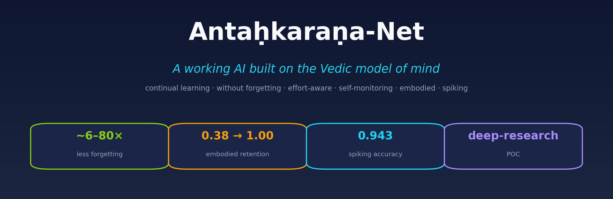
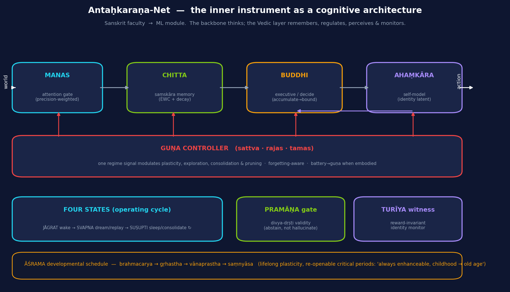
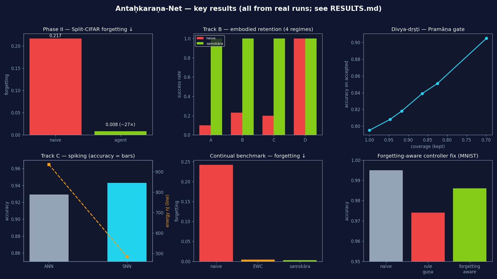

# Antaḥkaraṇa-Net



<p align="center">
  
  
  
</p>

<p align="center">
  
  
  
  
</p>

> **A working AI architecture built on the 2,500-year-old Vedic / Sanskrit model of mind** — the
> *antaḥkaraṇa* ("inner instrument"). One agent that **learns continually without forgetting**, scales
> its **effort and mood to its own state**, **perceives without hallucinating**, runs **embodied** and
> even on a **spiking (neuromorphic-style) substrate** — all validated on real hardware. A deep-research
> **proof-of-concept**: the foundation is built and measured honestly; scaling it is the next chapter.

---

## 1. What it is, in one breath

Modern AI already has the *pieces* of a mind — attention, memory, decision, control — but no principled
way to wire them into one self-regulating, lifelong-learning whole. **The Vedic model of mind is exactly
such a wiring diagram.** Antaḥkaraṇa-Net implements it: every Sanskrit faculty becomes a real ML module,
assembled into a single agent.

| Sanskrit faculty | What it does | ML module |
|---|---|---|
| **manas** (मनस्) | attention / perception gate | precision-weighted attention encoder |
| **buddhi** (बुद्धि) | discrimination, decision | evidence-accumulation / executive |
| **ahaṃkāra** (अहंकार) | the "I-maker" / self-model | identity latent |
| **chitta** (चित्त) | memory & the **subconscious** | continual memory (EWC **+ decay**) |
| **guṇas** (सत्त्व·रजस्·तमस्) | the three qualities | one controller of plasticity / explore / consolidate |
| **tapas** (तपस्) | concentrated effort | effort-allocation by need |
| **divya-dṛṣṭi / pramāṇa** | valid extended perception | calibrated abstention gate (anti-hallucination) |
| **turīya** (तुरीय) | the witness | reward-invariant identity monitor |
| **āśrama** | life-stages | lifelong plasticity schedule (childhood → old age) |

---

## 2. Why — the motivation

Two motivations meet here.

**(a) The Vedic psychology is a stunningly good *systems diagram* of mind.** The Upaniṣads, Sāṃkhya and
Yoga decompose cognition into a four-fold inner instrument, separate *awareness* from *processing* (the
"hard problem", 2,000 years early), give a four-state model of consciousness (waking / dream / deep-sleep
/ turīya), and a real theory of the **subconscious** (*saṃskāra / vāsanā*). It even contains a developmental
law — the *āśramas* — for how a mind should keep improving across a whole lifetime. (The full study is in
[`philosophy/`](philosophy/): texts & mantras, the modern-neuroscience cross-walk, the *Sanskrit formulae*,
the modern equations, and the architecture derivation.)

**(b) Today's AI has matching blind spots — and the Vedic model addresses each one:**

| Limitation of today's models | Antaḥkaraṇa-Net's structural answer |
|---|---|
| **No continual learning** (frozen after training) | **chitta**: incremental updates, never retrain from zero |
| **Catastrophic forgetting** | **saṃskāra** importance with growth **and** decay |
| **Full-retrain energy cost** (GWh) | update + **sleep-time consolidation**; spiking substrate |
| **Dense, always-full-power compute** | **guṇa**-scaled effort; event-driven spikes |
| **No self-monitoring across modes** | **turīya** reward-invariant monitor |
| **Confident hallucination** | **pramāṇa** validity gate (abstain, don't confabulate) |
| **Disembodied** (no action→consequence) | **karma loop** + **battery→guṇa** in the embodied agent |

---

## 3. How it works — the architecture



The backbone *thinks*; the Vedic layer **remembers, regulates, perceives, and monitors** around it:

- **Perception → decision pipeline:** manas (attention) → chitta (memory) → buddhi (decision) ↔ ahaṃkāra (self).
- **One guṇa controller** turns a 3-vector *(sattva, rajas, tamas)* into all the learning dynamics
  (plasticity, exploration, consolidation, pruning) — and it is **forgetting-aware** (protect hard tasks,
  back off on easy ones) and, when embodied, driven by the **battery** (low battery → *tamas* → conserve).
- **Four operating states:** *jāgrat* (wake/act) → *svapna* (dream/replay) → *suṣupti* (sleep/consolidate).
- **Two safety overlays:** the **pramāṇa** gate (extended perception must be *valid knowledge*, not fancy)
  and the **turīya** witness (a reward-invariant identity monitor).
- **The āśrama schedule** keeps plasticity non-zero for life and **re-opens critical periods** on novelty
  — the "always enhanceable, childhood → old age" property.

Because the control layer is **backbone-agnostic**, the *same* agent runs on a toy MLP, a real CNN, an RL
policy, or a spiking net — which is why embodiment and neuromorphic are *extensions* of one model, not
separate builds.

---

## 4. What we achieved — results (all from real runs)



| Phase | Result | Status |
|---|---|---|
| **Integration** | one agent, all faculties in a single wake/dream/sleep loop | ✅ |
| **Phase II — real CNN + data (GPU)** | Split-CIFAR: forgetting **0.217 → 0.008 (~27×)**; +9–10 pts accuracy | ✅ |
| **Forgetting-aware controller** | fixed the easy-task over-regularization (MNIST 0.974 → 0.986), kept the CIFAR win | ✅ |
| **Continual benchmark** | consolidation cuts forgetting ~**60–80×** (0.242 → 0.003) | ✅ |
| **Divya-dṛṣṭi + Pramāṇa** | accepted-prediction accuracy rises **0.80 → 0.91**, abstains on blind inputs | ✅ |
| **Track B — embodiment** | karma loop (success **1.00** vs random 0.30); **battery→guṇa** (ε 0.087 hungry → 0.122 charged); retention across 4 regimes **0.38 → 1.00** | ✅ |
| **Track C — neuromorphic (spiking)** | the spiking net **works** — **matches** ANN accuracy (0.943 vs 0.929) at 10.7% spike density; conservative ~1.9× software energy floor | ✅ spiking proven · ⏳ only chip deployment pending |

> **About Track C "pending".** The spiking network is **done and working** — it runs and matches the
> normal network's accuracy, which proves the architecture runs on event-driven (neuromorphic-style)
> computation. What is *pending* is **only deployment to a real neuromorphic chip** (Intel **Loihi 2** /
> BrainChip **Akida**), which we don't have. The **~1.9×** is a deliberately conservative *software
> estimate* (per-operation energy only); the famous **100–1000×** neuromorphic figures come from
> chip-only effects (event-skipping, in-memory compute, no data movement) that a GPU simulation cannot
> reproduce — so we report the floor, not the headline. Un-pending it needs a neuromorphic board + a port
> via Intel **Lava**; it is the *only* step in the whole project gated on hardware rather than code.

Full numbers, seeds, and the **honest caveats** are in [`RESULTS.md`](RESULTS.md); the staged plan is in
[`ROADMAP.md`](ROADMAP.md).

---

## 5. Why it's different (and why that matters)

- **Most "continual learning" papers fix *one* mechanism.** This is a *single agent* that unifies memory,
  effort, control, perception-validity and self-monitoring under one interpretable scheme — with an
  observable "mind-state" trace (life-stage, guṇa mix, plasticity, witness drift) you can read as it lives.
- **It learns *forever* without forgetting** — and the controller *learns when to protect*, so it doesn't
  over-regularize easy tasks (a failure mode we caught and fixed honestly).
- **It is honest about hallucination.** The pramāṇa gate is the engineering form of the Nyāya rule that
  extraordinary perception must be a *valid means of knowledge* — it **abstains rather than confabulate.**
- **It carries from supervised → embodied → spiking unchanged**, because the architecture (not a trick)
  is the contribution.
- **It is a research POC, stated plainly.** Strong faculties (consolidation, replay, pramāṇa,
  forgetting-aware control, task-conditioned policy) are proven; modest ones (tapas, decay) and conceptual
  ones (āśrama, the witness) are *labeled as such* — see the **component scorecard** in `RESULTS.md`.

---

## 6. Run it

```bash
pip install -r requirements.txt          # torch, numpy  (+ torchvision/snntorch for Phase II/C)

cd experiments
python3 integrated_agent.py              # ★ the whole agent + its mind-state trace (CPU, ~1 min)
python3 capacity_benchmark.py            # consolidation / decay / tapas ablation
python3 divya_drsti.py                   # extended perception + Pramāṇa validity gate
python3 track_b_v2.py                    # embodiment: karma loop + battery→guṇa + retention
# GPU (e.g. CUDA_VISIBLE_DEVICES=0):
python3 phase2_vision.py --dataset cifar10   # real CNN on Split-CIFAR
python3 track_c_spiking.py                   # spiking perception net (snnTorch)
python3 make_figures.py                      # regenerate the README figures
```

```
chittakit/     the novel modules — saṃskāra · guṇa · meta-guṇa · āśrama · tapas · pramāṇa · witness · antahkarana
experiments/   integrated_agent · capacity/continual benchmarks · divya_drsti · sanjaya · track_b · track_c · phase2_vision
philosophy/    the deep study: texts & mantras → modern science → Sanskrit formulae → math models → architecture
assets/        banner · architecture diagram · results figures
RESULTS.md     every number + the honest scorecard      ROADMAP.md   what's done / what's next
```

---

## 7. How it can be extended (it's amazing *because* it can grow)

- **Scale the backbone** — drop in a ResNet/ViT or a transformer; the Vedic layer is unchanged.
- **Neuromorphic hardware** — map the spiking parts to **Loihi 2 / Akida** (via Intel Lava) for the
  milliwatt, always-on form — the full energy thesis.
- **Real robot** — the embodied agent → **Jetson + ROS 2**, with a real battery driving the guṇa and an
  **event camera** feeding manas.
- **Meta-learn the controllers** — guṇa and tapas via meta-gradient / population-based training.
- **Richer sims** — MuJoCo / Isaac for physics; a continual RL stream for the karma loop at scale.

Each is *extension*, not invention: the hard part — assembling a coherent, lifelong, self-regulating agent
from the Vedic model and proving it on real and spiking hardware — **is done.**

---

## 8. Honest scope

This is a **deep-research proof-of-concept** at modest scale (small CNNs, MNIST/CIFAR, a gridworld) — enough
to *prove the architecture works*, not to rival a frontier model. Every negative result (the v1 RL-retention
miss, the neutral evolution-strategy run, the MNIST over-regularization) was **diagnosed and either fixed or
kept as a labeled limitation** — the discipline that makes the positive results trustworthy. The Vedic↔ML
mappings are engineering analogies, clearly flagged; no claim is made that the texts contain neuroscience,
and nothing here is conscious.

---

*Code: MIT. Built on the Upaniṣads, Sāṃkhya, Yoga, and modern ML (PyTorch · snnTorch). Part of a deep study
of the Vedic philosophy of mind — see [`philosophy/`](philosophy/).*
